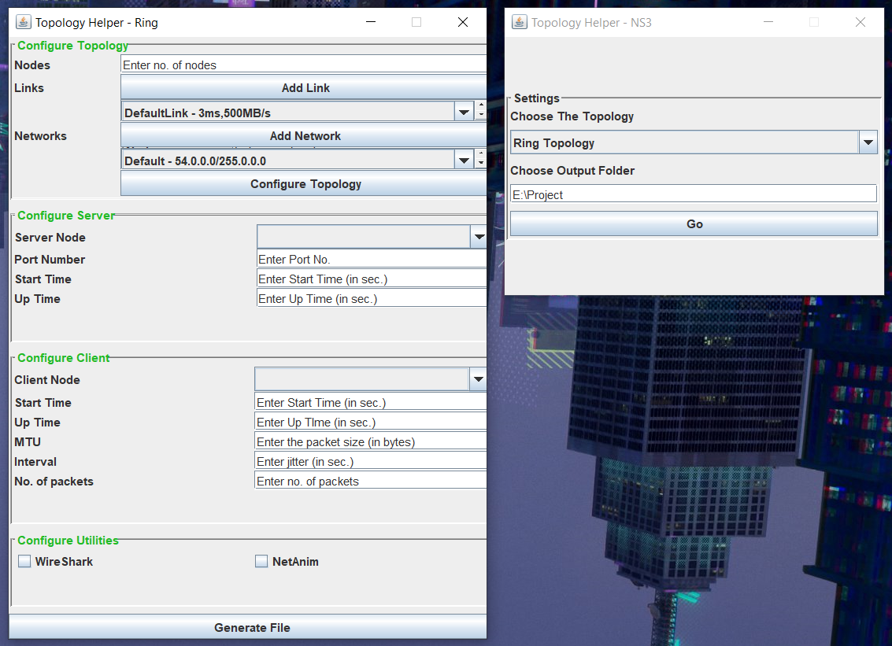
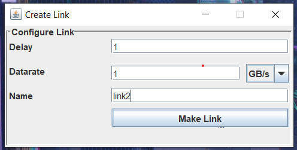
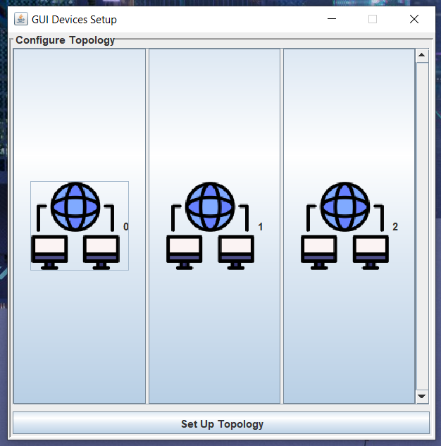
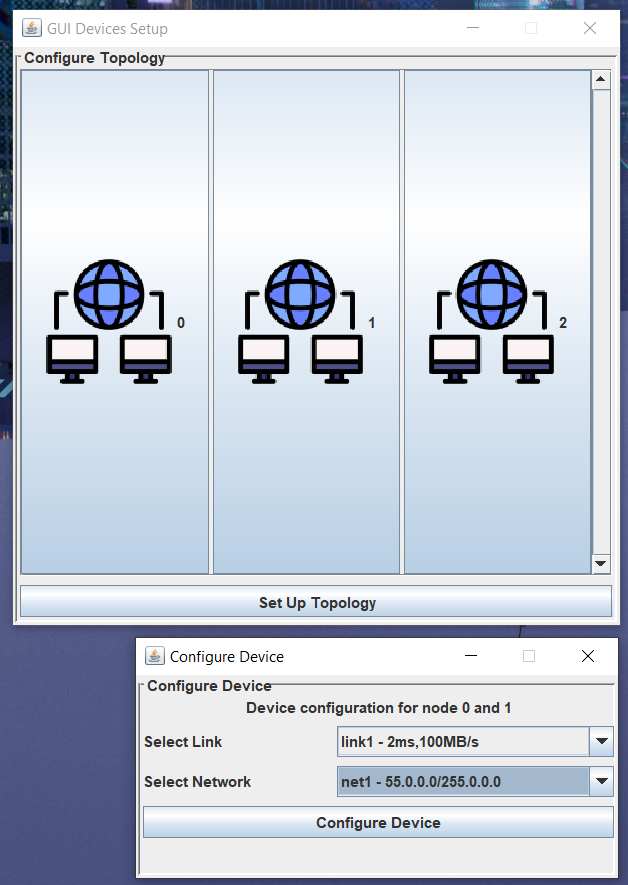

| [Home](../index.md) | [Final Product](../appImages.html) | Manul | [Releases](../releases.html) | [Doxygen](../doxygen/html/index.html) |
|:--------------------|:-----------------------------------|----------------------|------------------------------| --- |
| To Home Page        | To Final Product                   | This Page            | For Latest Updates           | To Doxygen |

# User's Manual
- This serves as a convenient, step-by-step guide on seamlessly utilizing the application. It provides a user-friendly approach to facilitate a faster learning curve, aiding users in adapting easily to NS3 coding.

## Generate Code For Ring Topology
- This section provides instructions on configuring a ring topology using this application and generating the corresponding code for your ring topology.
- In the initial step [Described Earlier](../manual.html), opt for 'Ring Topology' as your chosen topology type. Specify a valid system path for code generation. Upon clicking the 'Go' button, a dialog box, as illustrated in the image below, will appear.
     
    
- **Image Description** : This is the configuration dialog box for Ring Topology.
- **Remember** : In the first step, _**select 'Ring Topology'**_ and _**ensure to provide a valid system path**_ for file generation.
- This section presents several configuration windows, including Topology Configuration, Server Configuration, Client Configuration, and Utilities Configuration. Each window comprises multiple fields that necessitate valid inputs for code generation. Detailed explanations for each window are provided below.
- ### Topology Configuration
  - This section serves as the central hub for the entire configuration window. It introduces the **concept of P2P Links and Networks** in networking. To experiment with any topology type, it is essential to understand P2P Links and Networks, as **_they form the foundation for creating various topologies._**
  - If you possess sufficient knowledge about the aforementioned concepts, you'll notice buttons labeled **'Add Link'** and **'Add Network.'** These buttons are intended for creating links and networks, and the links and networks you create will be **_displayed in the respective combo boxes located below each button_**, as illustrated in the accompanying image.
     
    
  - This step is analogous to the **Topology Configuration step** for the 'Point To Point' topology [previously discussed](../manual.html). The key difference lies in the presence of multiple links. In this case, the dialog box facilitates the addition of multiple links.
  - To add a link, simply click the 'Add Link' button. This action will open a new dialog box, as depicted below.
   
    
  - **Image Description** : If you wish to add a link with a Delay Attribute of '1' millisecond and a Data rate of '1' GB/s, follow the steps depicted in the image above. Enter the specified values, select the appropriate speed modifier from the combo box for the data rate, provide a unique name for identification, and then click the 'Make Link' button. This action will display the newly created link in the combo box of links, as illustrated in the image.
  - **Remember** : A unique name is essential for distinguishing between different links.
  - To add a network, click the 'Add Network' button. This action will prompt a dialog box to appear, as depicted below.
  - This step mirrors the IP settings configuration [previously encountered](../manual.html) in the configuration box for the 'Point To Point' topology. However, in this context, the dialog box enables the creation of multiple networks, a necessary component for topology creation.
   
    
  - **Image Description** : If you intend to add a network with a **_Net ID of '56.0.0.0,'_** a **_subnet mask of '255.0.0.0,'_** and a **_unique name 'net2,'_** follow the input requirements outlined in the image above. Subsequently, clicking the 'Make Network' button will append this network to the combo box of networks, as illustrated earlier.
  - **Remember** : _**A unique name**_ is crucial for _distinguishing between different networks_.
  - After ensuring that you have an adequate number of links and networks for creating the topology, click the 'Configure Topology' button. This action will open a dialog box containing buttons labeled from 0 to the desired number of links required to create the ring topology with the specified number of nodes.
   
    
  - **Image Description** : Configure each link by clicking on the respective button, which will open a new dialog box for device configuration.
  - **Remember** : Before clicking on the 'Configure Topology' button, ensure that you have **specified a valid number of nodes**. This information is essential as the **_application calculates the number of links required based on_** the fact that a _topology with 'n' nodes_ necessitates _'n' point-to-point connections_.
  - Below is the device configuration dialog box.
     
    
  - **Image Description** : You'll find information about the nodes connected via the link, forming a device. To bind the link and network with that device, select the created link and network from the combo box as shown in the image. Finally, click on the 'Configure Device' button.
  - **Remember** : Verify the nodes connected via the link to ensure that you generate the exact topology you desire.
  - After configuring all the devices, click the 'Set Up Topology' button to establish the connections between the devices using the links and networks you have provided.
 

- ### Server Configuration
  - This section **mirrors the process we [previously followed](../manual.html) for the point-to-point topology**. However, now, you have the additional option of a combo box to select the server node index, given that there are more than two nodes in the topology.
  - **Remember** : The server index selection will only become enabled after you have set up the topology in the initial step mentioned above.
 

- ### Client Configuration
  - This step closely resembles the [procedure we followed for the point-to-point topology](../manual.html). However, now we have the added feature of a combo box to select the client index, taking into account the presence of more than two nodes.
  - **Remember** : The client index selection will only become enabled after you have set up the topology in the initial step mentioned above.
 

- ### Utilities Configuration
  - This section is also same as we have done for the point to point topology [mentioned earlier](../manual.html).

- After completing all the necessary steps, click the 'Generate File' button to produce the NS3 code.

## How to ...
- [Generate Code For Point To Point Topology!](../manual.html)
- [Generate Code For Mesh Topology!](./manualMesh.html)
- [Generate Code For Star Topology!](./manualStar.html)
  