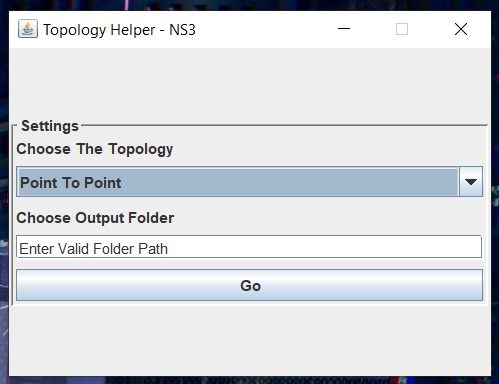
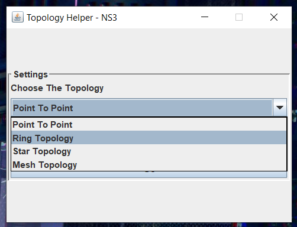
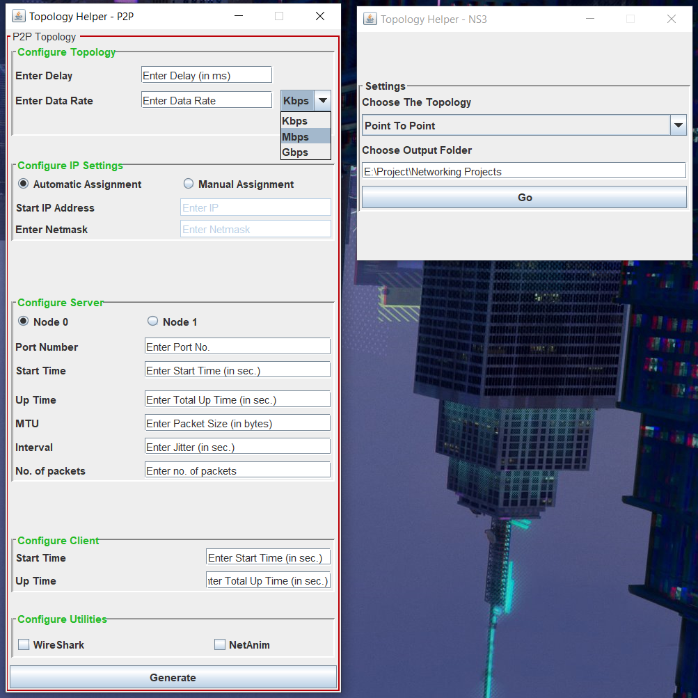
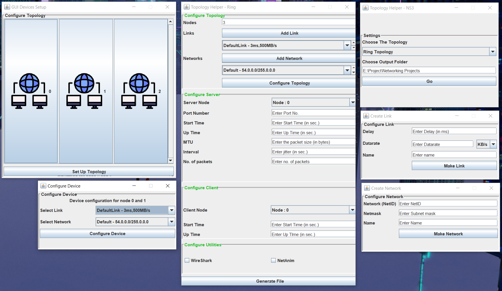

| [Home](./index.html) | Final Product | [Manual](./manual.html) | [Releases](./releases.html) |
|:---------------------|:--------------|-------------------------|-----------------------------|
| To Home Page         | This Page     | To User Manual          | For latest updates          |

# Application Images
- We've included a sneak peek of the final desktop application, granting you an immediate glimpse of its functionality and satisfying your curiosity to witness it in action.
  <marquee direction="left" height="100px" style="color: red; font-weight: bold; font-style: italic;">
    This images belongs to very first release of this application. &nbsp;&nbsp;&nbsp;&nbsp;&nbsp; | &nbsp;&nbsp;&nbsp;&nbsp;&nbsp; For latest updates and sneak peek, checkout <a href="https://github.com/NetworkingDevs/NS3-GUI-HELPER/discussions/8">here</a>!
  </marquee>

## Main Screen
- The primary interface of the application features a selection menu allowing users to choose their desired networking topology for code generation. Additionally, it requires users to specify a valid path where the generated code file will be stored.
  
  

## Choosing the topology
- This interface allows you to effortlessly pick from the listed networking topologies.
    
  

## Point To Point Interface
- This interface is designed for configuring Point-to-Point networking topology. Once you've filled in all the necessary fields, a simple click on the "Generate" button will generate the code and save it at the specified location mentioned in the previous step.
    
  

## Generalized Code Generation Interface
- For the remaining networking topologies mentioned, this interface serves as a unified platform to generate code tailored to each specific topology. For a more in-depth walkthrough of the steps, please refer to the manual section.
    
  
