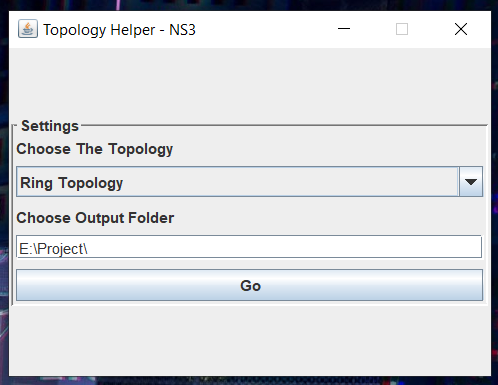
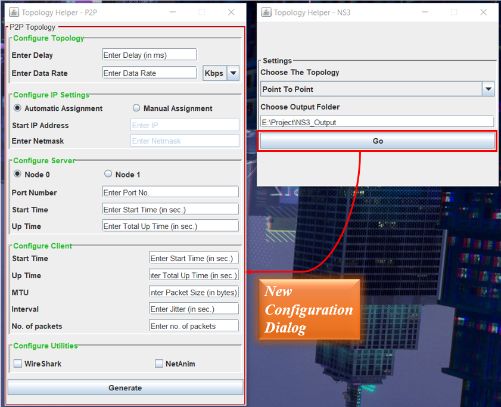
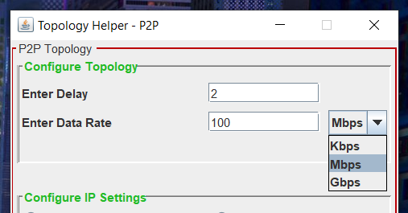
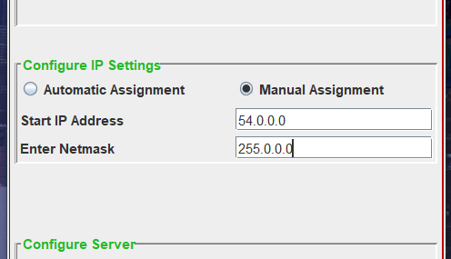
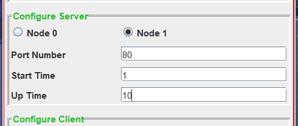
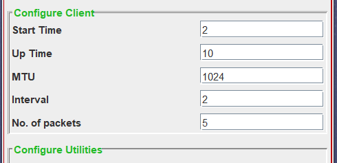

| [Home](./index.md) | [Final Product](./appImages.html) | Manul |  [Releases](./releases.html)  |
|:-------------------|:----------------------------------|----------------------|--------------------|
| To Home Page       | To Final Product                  | This Page            | For latest updates |

# User's Manual
- This serves as a convenient, step-by-step guide on seamlessly utilizing the application. It provides a user-friendly approach to facilitate a faster learning curve, aiding users in adapting easily to NS3 coding.

## Choosing the type of Networking Topology
- This section covers the initial and fundamental step of the application. 
- Simply **choose** your _desired networking topology_ for code generation, and then **provide** a _valid system path_ where the _**'output.txt'**_ file, containing the NS3 code, will be generated.
 
  
- **Image Description** :  User has selected 'Ring Topology' from combo box and given a path in output folder.
- **Remember** : To Give Valid System Path!

## How to generate code for Point To Point Topology
- In this section, you'll find a concise explanation of how to generate code for the fundamental Point-to-Point networking topology.
- Following the initial step, selecting the "Point-to-Point" Topology, and specifying a valid system path for file generation **[(mentioned above)](#choosing-the-type-of-networking-topology)**, simply click the "Go" button to access the configuration dialog box for the Point-to-Point topology.
 
  
- Inside the new dialog box, you'll encounter **a range of configuration windows**. The image illustrates configuration windows for **_Topology, IP Settings, Server Settings, Client Settings, and Utilities Settings_**. Each of these segments necessitates valid inputs to effectively generate code for the Point-to-Point Topology. Detailed explanations for each setting are provided below.
- ### Topology Configuration
  - This configuration window pertains to defining the **attributes of the point-to-point link** between two nodes, **_as interpreted within the context of NS3_**.
  - In the fundamental configuration of a point-to-point link, users are tasked with **specifying the delay and data rate attributes** of the link. This configuration window requires valid inputs, **_necessitating a foundational understanding of point-to-point links_** in networking.
   
    
  - **Image Description** : Imagine you intend to evaluate your point-to-point topology with a link configured to have a 2ms delay and a data rate of 100 MB/s. To achieve this, input "2" in the Delay text field and "100" in the Data rate text field. Additionally, select "MB/s" as the speed modifier, as illustrated in the provided image.
  - **Remember** : The Delay text field automatically interprets values as milliseconds, eliminating the need to explicitly write "ms." Any entry other than a numerical value will trigger an error during code generation. However, users have the flexibility to manually adjust the generated file if they prefer a unit other than "ms."
- ### IP Settings Configuration
  - In this configuration window, you'll **configure the IP settings** for the point-to-point link. You have two options for IP assignment: automatic or manual assignment. As shown the radio buttons in the figure.
  - For users with **limited knowledge of IP settings** or those less familiar with IP assignment, the **_automatic IP assignment_** option is available. This feature automatically configures the IP settings.
  - However, for those who prefer manual assignment or **wish to experiment with the settings**, they can provide the Net ID and Netmask in the respective text fields, as illustrated in the image below. It's important to note that manual IP assignment entails entering valid inputs, **_requiring a basic understanding of IP assignment_** in networking.
   
    
  - **Image Description** : Suppose you wish to configure IP assignment manually with a Net ID of "54.0.0.0" and a Netmask of "255.0.0.0." To achieve this, select the Manual Assignment radio button to enable the corresponding text fields, and then enter the provided details in the respective text fields as shown in the picture above.
  - **Remember** : It's important to note that the Manual Assignment radio button must be selected to enable the text fields. By default, these fields are disabled, preventing input until manual assignment is specifically chosen.
- ### Server Configuration
  - In this section, you'll **configure the server settings**, involving numerous variable fields. This includes specifying the node index to designate which node you want to set up as the server.
  - Given the nature of the point-to-point topology, featuring only two nodes, each node is represented by a corresponding radio button. You can _**select the node index_** by choosing the appropriate radio button. Subsequently, provide the **_server's port number_** (a valid integer), **_start time_**, and **_up time_** (for event timeline, in seconds).
   
    
  - **Image Description** : Suppose you want to designate the node with index 1 as the server. In that case, you can select the radio button labeled "Node 1." Specify that the server application should run on port 80 by entering "80" in the port number field. Additionally, define the start time and uptime of the server in relation to the event timeline in NS3. Enter the start time as a numeric value, interpreted as seconds by default. Specify the total uptime, indicating the duration for which the server will be running. The stop time will be calculated automatically based on these inputs. Reference the image above for visual guidance.
  - **Remember** : No need to explicitly mention "seconds" or any time string in the start and up time fields; they are automatically interpreted as seconds by default. However, users have the flexibility to customize them manually after the file generation if needed.
- ### Client Configuration
  - This configuration window focuses on defining the attributes for the client node. Given the limited number of nodes (two) in the point-to-point topology, there's no need to explicitly mention the client node, as the server node has been specified in the preceding section.
  - Additionally, you must specify the start and up time for the client, mirroring the process outlined for the server. Beyond that, provide details such as the Maximum Transmission Unit (MTU), Interval between two packets (Jitter), and the number of packets that the client will send in the respective fields.
     
    
  - **Image Description** : If you intend to configure the client to send packets of size "1024," dispatching a total of 5 packets with a 2-second time gap between each, and the client initiating at 2 seconds with a total uptime of 10 seconds, simply fill in the corresponding text fields as depicted in the image.
  - **Remember** : Ensure familiarity with networking terms before providing inputs to the client configuration fields to avoid receiving warning messages indicating invalid inputs.
- ### Utilities Configuration
  - In this section, you have the option to configure additional utilities offered by NS3. Two utilities, Wireshark and NetAnim, are provided for experimentation.
  - The Wireshark utility facilitates the generation of ".pcap" (packet capture) files. You can conveniently explore and enable this utility directly from the configuration if you wish to utilize it for the creation of ".pcap" files.
  - Similarly, the NetAnim utility offers the capability to generate ".xml" files for visualizing your topology in the NetAnim application. You can easily access and activate this utility directly from the configuration.
  - Simply checking the checkbox will handle all the necessary coding for the respective utility, streamlining the configuration process.
     
    
- ### Generate the code
  - After completing all the configuration steps, click the "Generate" button to initiate the code generation process.
  - The generated code will be stored at the destination specified in the [initial step](#choosing-the-type-of-networking-topology), with the filename "output.txt," encompassing the configured parameters and attributes.
     
    
  
## How to ...
- [Generate Code For Ring Topology!](./Manual/manualRing.html)
- [Generate Code For Mesh Topology!](./Manual/manualMesh.html)
- [Generate Code For Star Topology!](./Manual/manualStar.html)

